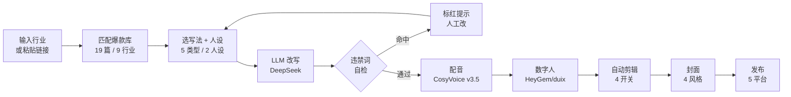

# 数字人短视频智能体平台

> 一套完整的「文案改写 → 配音 → 数字人 → 自动剪辑 → 封面 → 发布」全自动短视频生产线
> 买断式本地 / 云端部署（非 SaaS 开放注册）｜登录鉴权 ｜ 多用户隔离 ｜ 任务进度可视化


---

## 这是什么

面向**短视频创作者 / 商家 / IP 矩阵**的一站式生产平台。登录后一条龙产出可发布的口播视频：

- **改写**：行业爆款文案库 + 5 种写法类型 + 角色人设 + 违禁词自检
- **配音**：阿里云百炼 CosyVoice v3.5（声音克隆 / 7 种情绪）
- **数字人**：HeyGem / duix.avatar（PAI-EAS，音频驱动对口型，OSS 中转）
- **剪辑**：自动调色 + 网感大字 + MG 动画 + 背景音乐（4 开关）
- **封面**：4 种爆款风格模板（标题型 / 对比 / 悬念 / 表情）
- **发布**：抖音 / 视频号 / 小红书 / 快手 / B 站（按开关切换占位 / 真实开放平台）

> 接真实服务时，**只改 `app/config.py` 里的环境变量**，前端和流程零改动。

---
## 下面是作品展示

> 由 `digital_human_platform` 一键产出的口播视频样片：文案改写 → CosyVoice 配音 → HeyGem 数字人 → 自动剪辑。

<video src="https://img.triview.cn/ai/video/digital_human_anuo.mp4"
       controls
       width="100%"
       preload="metadata"
       style="max-width:720px; border-radius:8px;">
  <source src="https://img.triview.cn/ai/video/digital_human_anuo.mp4" type="video/mp4">
  你的浏览器不支持 HTML5 视频播放，请<a href="https://img.triview.cn/ai/video/digital_human_anuo.mp4">点此下载</a>查看。
</video>
---

## 全流程一览



---

## 一、快速启动（Windows）

### 方式 A：直接打开（现在就能用）

后端服务启动后浏览器访问：

```
http://localhost:8000
```

### 方式 B：一键重启（换机器 / 改完代码）

项目根目录双击 `start.bat`（**已脱敏**，不包含真实密钥；密钥在系统环境变量里）：

```bat
D:\ai\workbuddy\opc\digital_human_platform\start.bat
```

或手动：

```bat
cd D:\ai\workbuddy\opc\digital_human_platform
venv\Scripts\activate
python main.py
```

启动后控制台打印 `Uvicorn running on http://0.0.0.0:8000` 即成功。
若 8000 端口被占用，改 `main.py` 末尾的 `port=8000` 为其他值。

---

## 二、默认账号与激活码

**演示账号：**

| 用户名 | 密码 | 套餐 |
|---|---|---|
| `laopan` | `laopan123` | 买断，月额度 500 条 |

**种子激活码**（注册新用户时使用，见 `app/db.py`）：

```
LAOPAN2026   BUYOUT2999   BUYOUT4399   TESTFREE
```

注册入口在登录页「注册」：填用户名 + 密码 + 激活码，即创建新买断账号（月额度 500、并发 2 路）。
**生产环境务必删除 `TESTFREE` 等公开码**，改为后台批量生成的一次性激活码。

---

## 三、功能链路

登录后首页两个入口：

### 入口一 · 行业爆款改写
1. 输入行业 → 系统匹配该行业爆款文案库（见 `app/data/viral_scripts.py`）
2. 选一篇 → 进入改写页
3. 选**写法类型**（5 种）：解题型 / 推荐型 / 揭秘型 / 案例型 / 疑问型
4. 选**人设**（2 种）：老板 / 专家
5. 点「开始生成」→ 弹框预览改写文案
6. 「违禁词检查」按钮（4 类 ~50 词：绝对化 / 医疗 / 诱导 / 导流）→ 命中标红
7. 满意 → 「前往配音」；不满意 → 「重新生成」

### 入口二 · 链接提取改写
- 粘贴视频链接 → 提取文案（百炼 Paraformer-v2 ASR）→ 后续流程同入口一

### 配音页
- 上传音色（或默认合成音）→ 选「我的音色」
- 情绪（7 种）：自然 / 嫌弃 / 高兴 / 伤心 / 说教 / 激动 / 生气
- 语速滑块 → 点生成 → 全屏遮罩进度条
- 完成可试听、重新配音、下载配音

### 数字人页
- 上传形象（图片或视频）→ 生成预览（静态形象 + 配音）
- 选形象 → 「生成口播视频」→ 进度条 → 展示视频
- 真实推理走 HeyGem/duix（GPU），无 GPU 时降级为静态图 + 音频预览

### 剪辑页（自动）
- 4 个开关：① 自动调色 ② 网感大字 ③ MG 动画 ④ 背景音乐
- 点「开始剪辑」→ 智能剪辑进度条 → 出片

### 封面页
- 预制 4 种风格：大字标题型 / 对比型 / 悬念型 / 表情包型
- 选风格 → 满意 → 「前往发布」

### 发布页
- 平台：抖音 / 视频号 / 小红书 / 快手 / B 站
- 当前为占位发布（写库标记成功）；接各平台开放平台 API 后为真实发布

---

## 四、目录结构

```
digital_human_platform/
├── main.py                 # 入口，组装 FastAPI，挂载静态资源与 /files
├── start.bat.example       # 启动模板（真实密钥在环境变量；start.bat 已被 gitignore）
├── app.db                  # SQLite 数据库（首次启动自动建表 + 种子）
├── app/
│   ├── config.py           # 全局配置 + AI 推理替换位（接真实服务的开关 / 密钥）
│   ├── db.py               # SQLite 数据访问 + 种子账号 / 激活码
│   ├── auth.py             # JWT 鉴权（注册需激活码，不开放注册）
│   ├── task_manager.py     # 任务进度管理（0-100，前端轮询）
│   ├── routers.py          # 全部 API 路由（全链路串联）
│   ├── data/
│   │   ├── viral_scripts.py     # 9 行业 / 19 篇爆款文案库
│   │   └── sensitive_words.py   # 违禁词库（4 类 ~50 词）
│   └── services/
│       ├── script_service.py    # 改写 / 链接提取
│       ├── cosyvoice_client.py  # 阿里云百炼 CosyVoice v3.5 配音 / 声音复刻
│       ├── heygem_client.py     # HeyGem / duix.avatar 对口型客户端（PAI-EAS + OSS 中转）
│       ├── asr_client.py        # 抖音链接提取 + 文案 ASR（百炼 Paraformer-v2）
│       ├── oss_client.py        # OSS 文件中转（本地平台 ↔ 云端 EAS）
│       ├── classify.py          # 行业分类
│       └── media_utils.py       # ffmpeg 合成 / 静态图+音频降级预览
├── static/
│   ├── index.html          # SPA 外壳
│   ├── css/styles.css
│   └── js/{api.js, app.js} # 前端逻辑（路由、双入口、全流程页面）
└── storage/                # 生成的媒体文件（不入库；audios/avatars/videos/...）
```

---

## 五、AI 推理替换位（生产化关键）

所有占位实现都集中在 `app/config.py` 用环境变量开关，接真实服务改这里即可，**不动前端**：

| 环节 | 当前（演示） | 生产替换 | 关键变量 |
|---|---|---|---|
| 文案改写 | 模板拼接 | DeepSeek / GPT / 通义千问 | `LLM_API_KEY` / `LLM_BASE_URL` / `LLM_MODEL` |
| 配音 TTS | 占位 WAV | 阿里云百炼 CosyVoice v3.5（声音克隆） | `DASHSCOPE_API_KEY` / `DASHSCOPE_TTS_MODEL` |
| 数字人 | 静态图 + 音频 | HeyGem / duix.avatar（PAI-EAS，音频驱动对口型） | `AVATAR_PROVIDER=heygem` / `HEYGEM_ENDPOINT` |
| 文案 ASR | 占位提取 | 阿里百炼 Paraformer-v2 | `DASHSCOPE_API_KEY` |
| 文件桥 | 走磁盘 | 阿里云 OSS 中转（公网 / 内网双 endpoint） | `OSS_BUCKET` / `OSS_ACCESS_KEY_*` |
| 发布 | 占位写库 | 抖音 / 视频号开放平台 | `PUBLISH_ENABLED=1` |

---

## 六、生产化 checklist（卖给客户前必须做）

1. **改密钥**：`DH_SECRET_KEY` 走系统环境变量，别用默认值；激活码换成后台生成的一次性码。
2. **HTTPS**：只开 443，Caddy / Nginx 反代 + 免费证书；别裸 http 暴露。
3. **Redis 队列**：当前用内存线程做任务，多用户并发时上 Redis（防单人薅爆 GPU）。
4. **GPU 上云**：本地 CPU 只能预览。量产把 HeyGem 部署到阿里云 T4（ecs.gn6i），前端 `HEYGEM_ENDPOINT` 指向它。
5. **OSS 中转**：用户上传 → OSS 签名 URL → EAS 拉取；EAS 跑完 → OSS 结果 → 本地平台下载。
6. **多用户隔离**：数据库所有查询已带 `user_id`，租户数据天然隔离。
7. **合规**：用户协议写明禁止上传他人肖像 / 声音；生成内容建议加 AI 标识；数字人声音参考《民法典》肖像 / 声音权。
8. **安全组**：云服务器只放行 443 + SSH（改非 22），其余全关；服务别用 root 跑。

---

## 七、已知限制

- 无 ffmpeg / 无 GPU 时，数字人 / 剪辑视频降级为「静态形象图 + 配音音频」预览（已装 `imageio-ffmpeg`，多数环境可直接出 MP4）。
- 移动端布局未专项优化（演示版优先 PC）。
- 任务状态存内存（`task_manager.py`），进程重启后**进行中**的任务进度丢失（已完成的结果已落库不受影响）。
- **数字人底座（HeyGem / duix.avatar）为音频驱动对口型**：仅驱动面部口型与头部微动，**不会根据文案语义自动生成肢体动作**。参考视频里的动作按原时序播放，与配音内容不一定对齐。若需动作与口播同步，要么选「不出动作、只做口播头部」的干净形象，要么后续加「动作时间轴手动对齐」功能。

---

## 八、Roadmap

- [ ] 发布接真实开放平台（抖音 / 视频号优先）
- [ ] 数字人动作时间轴手动对齐
- [ ] 移动端响应式优化
- [ ] 任务队列上 Redis（多用户并发治理）
- [ ] 行业爆款库接入真实数据源（巨量算数 / 蝉妈妈）

---

## License

本仓库为**私有交付版**，授权给付费客户使用。
禁止未授权的二次分发与商业转售。

扫码进群

